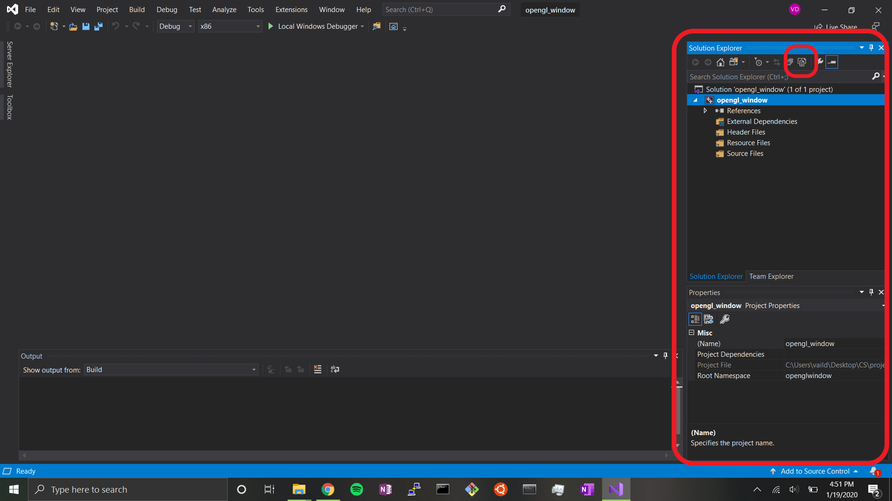

# Setting up C++ and OpenGL

This is a project where I'm going to learn how to set up OpenGL with C++. Hopefully this will serve as a future reference for me and anyone who is interested in learning to do this.

## Visual Studio

Visual Studio is a development environment, package manager, and IDE developedby Microsoft. Many choose it for its built-in debugging and ease of use for project management.

#### Installing Visual Studio
For this project, I decided to use VisualStudio 2019 with the community license, largely because of its convenience and building utilities.
You can find the download link [here](https://visualstudio.microsoft.com/vs/features/cplusplus/).

- Go to the link and download visual studio community 2019.
- Start the install (I just followed the install instructions with default settings).
- Restart computer

#### Running a Visual Studio C++ Project

- create an empty c++ project and place it where you want.
- once it opens, you should see a file directory on the right of the interface. Right click the source folder, click add, and add a c++ .cpp file
- create a simple hello world or anything to test
- click build in the top menu and then build solution (or ctr+shift+b)
- click debug, then start without debugging (or ctr+F5)
- this will run your cpp code.

## GLFW

[Here](https://www.glfw.org/faq.html#11---what-is-glfw) you can find the FAQs on GLFW, as well as the rest of the documentation on what it is. My understanding is that GLFW is a utility library for OpenGL that simplifies some of the low-level tasks like creating and managing windows and contexts.

#### Installing GLFW

[Here](https://www.glfw.org/download.html) is the link to download. It is important that you download the proper 32 or 64 bit version.

- Press and hold the windows key and then hit the pause break key while the windows key is pressed. Next to system type, it will tell you if you have 32 or 64 bit.
- On the download page, download the binaries that match your bit count. Extract this download somewhere you will remember.

## Creating an Empty Window Using GLFW and C++

I will be following [this](https://www.youtube.com/watch?v=AwVVt9Ht5Q8) tutorial, but I will type the steps here as well. 

- Open VisualStudio
- Select file, new project
- Select Empty Project
- Choose a project name and directory, and click Create
Your project has now been created. On the right, you should see a tab with the title Solution Explorer. In this window, there is a button called show all files. you can see the tooltip if you mouse over it, and the image below shows the location of this button.

